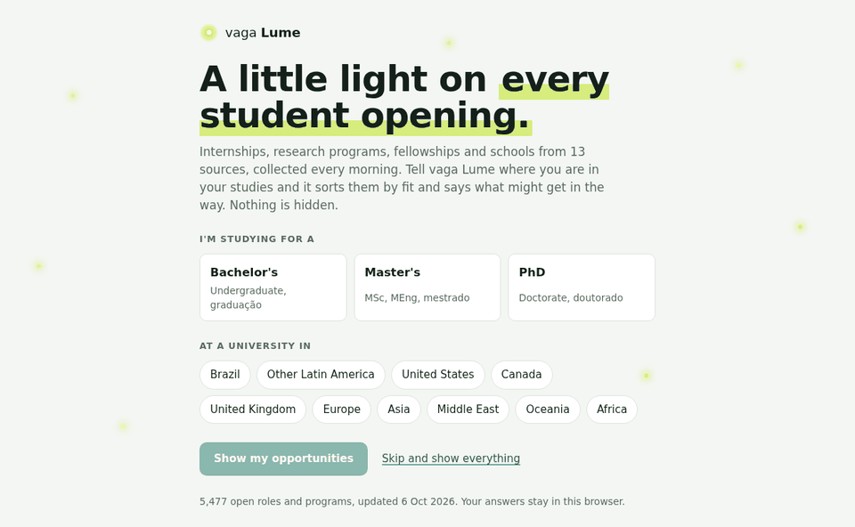
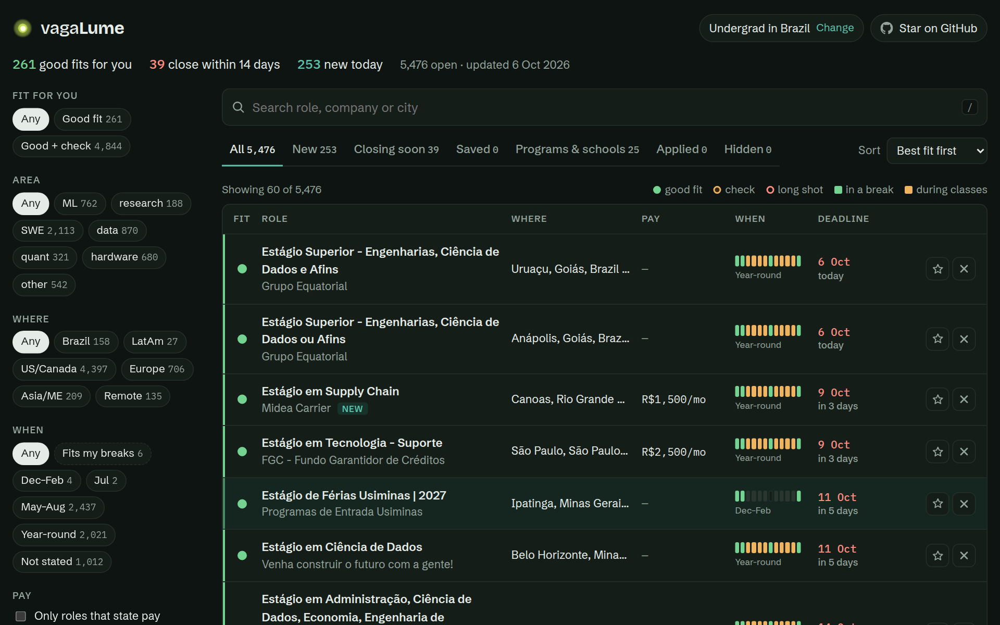
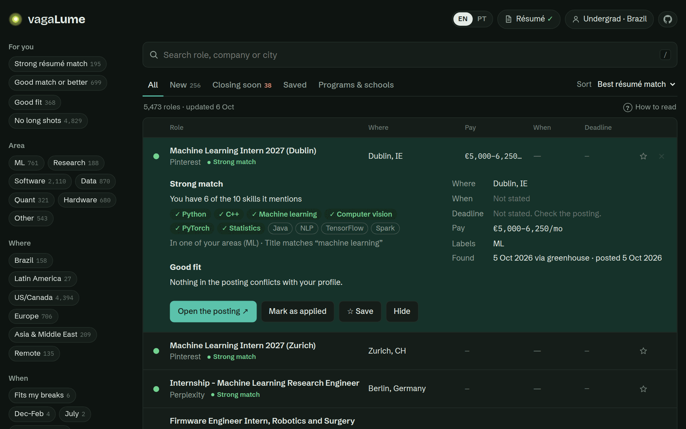
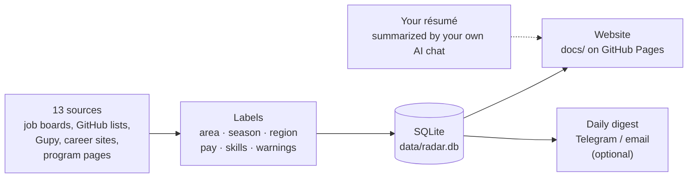

<p align="center">
  <a href="https://pedrocamargolince.github.io/vagaLume/">
    
  </a>
</p>

<p align="center"><a href="README.md"></a></p>

<p align="center">
  <a href="https://pedrocamargolince.github.io/vagaLume/"></a>
  <a href="https://github.com/PedroCamargoLINCE/vagaLume"></a>
  <a href="GUIDE.md"></a>
  <a href="https://github.com/PedroCamargoLINCE/vagaLume/fork"></a>
</p>

<p align="center">
  
  
  
  
  
  <a href="https://github.com/PedroCamargoLINCE/vagaLume/actions/workflows/radar.yml"></a>
</p>

<p align="center">
  <b>Every internship, research program, fellowship and summer school for students,<br>
  collected every morning and sorted by how well it fits <i>you</i>.</b>
</p>

<p align="center">
  
</p>

---

## Why vagaLume?

Hunting for internships means checking dozens of career pages, a few GitHub
lists, Gupy, and every summer-school site, every single week. *Vaga* is
Portuguese for a job opening, and a *vagalume* is a firefly: vagaLume is a
little light that finds the openings for you.

| | |
|---|---|
| 🔭 **13 sources, one list** | Greenhouse, Lever and Ashby boards of 150+ companies, the SimplifyJobs lists, Gupy (estágio in Brazil), Google, Amazon, Microsoft, NVIDIA, Meta, D. E. Shaw, DRW and 25 research-program pages. About **5,400 open roles** on a normal day. |
| 🎯 **Sorted by fit, never filtered for you** | Tell it whether you're doing a Bachelor's, Master's or PhD and where you study. Every role gets a dot (good fit, check something, long shot) and the reason, like *"needs US work authorization"* or *"aimed at PhD students"*. Nothing is ever hidden unless you hide it. |
| 📄 **Match your résumé** | Paste a ready-made prompt and your résumé into the AI chat you already use (ChatGPT, Gemini, Claude…), paste its answer back, and every role shows how well it matches: *"you have 6 of the 10 skills it mentions"*. No AI runs inside vagaLume and your résumé never leaves your hands. |
| 💸 **Pay, when it's stated** | `$54–60/hr`, `R$1,357/mo`, `€1,800/mo`: read from job boards and descriptions in English and Portuguese. |
| 📅 **Fits your calendar?** | A tiny January–December strip on every role shows whether it falls in your breaks or clashes with your semester. |
| ⏰ **Deadlines up front** | Closing-soon roles and brand-new ones each get their own tab. |
| 🌐 **English and Português** | The site opens in Portuguese for Brazilian browsers, and an **EN \| PT** switch at the top changes it any time, including the résumé prompt. |
| ☆ **Your shortlist** | Save, mark as applied, or hide. Filters live in the link, so you can bookmark *"ML roles in Europe"* or send it to a friend. |

<details>
<summary><b>Some of the companies and programs it watches</b></summary>
<br>

**AI labs:** Anthropic, OpenAI, xAI, Cohere, Thinking Machines, Perplexity, Cursor, ElevenLabs, Physical Intelligence, Isomorphic Labs<br>
**Big tech:** Google, Microsoft, Meta, Amazon, NVIDIA, Stripe, Databricks, SpaceX, Cloudflare, Figma<br>
**Trading:** Jane Street, Hudson River Trading, Jump, Optiver, IMC, Two Sigma, D. E. Shaw, DRW, SIG, Five Rings<br>
**Brazil:** Nubank, Stone, QuintoAndar, BTG Pactual, XP, Banco Inter, C6, EBANX, VTEX, CI&T, plus the newest estágios on Gupy every day<br>
**Research programs and schools:** ISTA ISTernship, ETH SSRF, Summer@EPFL, OIST, KAUST VSRP, Mitacs Globalink, Google Student Researcher, Anthropic Fellows, MATS, EEML, OxML, MLSS, Khipu, LatinX in AI, IMPA Summer Program

</details>

## See it





Works on phones too, in light and dark mode. **[Open it →](https://pedrocamargolince.github.io/vagaLume/)**

## How it works



Every morning at 09:00 (Brasília) a GitHub Action runs the Python bot, reads
every source politely (it identifies itself and waits between requests), labels
each posting with keyword rules, optionally asks Claude for sharper labels, and
publishes the result. One failing source never breaks the run, and the site's
Sources table shows which ones worked.

## Run your own in 5 minutes

1. **[Fork this repository](https://github.com/PedroCamargoLINCE/vagaLume/fork).**
2. In your fork, go to **Settings → Actions → General** and choose **Read and write permissions**.
3. Go to **Settings → Pages → Deploy from a branch → `main` / `/docs`**.
4. Open **Actions → vagaLume → Run workflow**. A few minutes later your site is at `https://<your-username>.github.io/vagaLume/`.
5. Make it yours: add companies to [`config/companies.yaml`](config/companies.yaml), programs to [`config/programs.yaml`](config/programs.yaml), and searches to [`config/search.yaml`](config/search.yaml).

Optional: Telegram or email digests and Claude labelling. Setting up the secrets is covered in the [guide](GUIDE.md#secrets-all-optional).

```bash
# or run it on your computer
pip install -r requirements.txt
python -m playwright install chromium
python -m radar          # collect everything (about 5 minutes)
python -m http.server -d docs   # then open http://localhost:8000
```

## Learn more

The **[full guide](GUIDE.md)** explains every source and its limits, what each
label and warning means, how pay is detected, how to add a company or a program
page, the code layout (written to be readable by beginners), and the tests.

## Like it? ⭐

If vagaLume helps you find something, **star the repository**. It's the
easiest way to help other students find it too.

<p align="center">
  <a href="https://github.com/PedroCamargoLINCE/vagaLume"></a>
</p>

<p align="center">
  <a href="https://star-history.com/#PedroCamargoLINCE/vagaLume&Date">
    <picture>
      <source media="(prefers-color-scheme: dark)" srcset="https://api.star-history.com/svg?repos=PedroCamargoLINCE/vagaLume&type=Date&theme=dark">
      
    </picture>
  </a>
</p>

<p align="center"><sub>Made in Brazil by a UNESP engineering student · MIT license · no LinkedIn scraping, no sites that block bots</sub></p>
