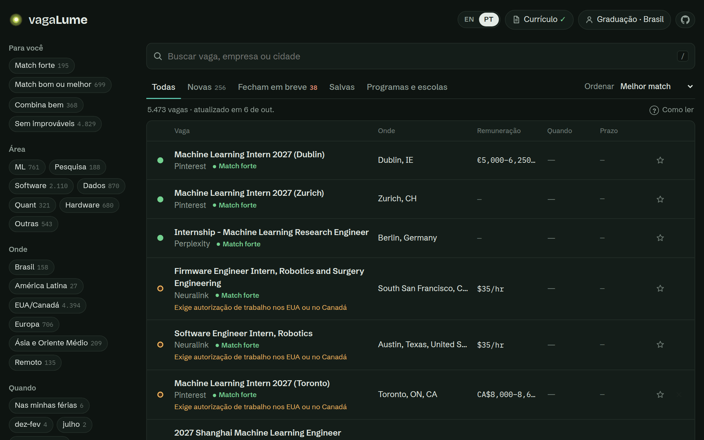
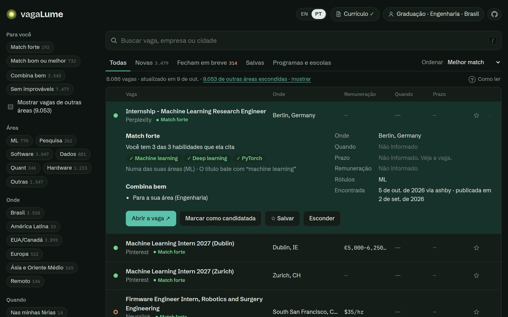
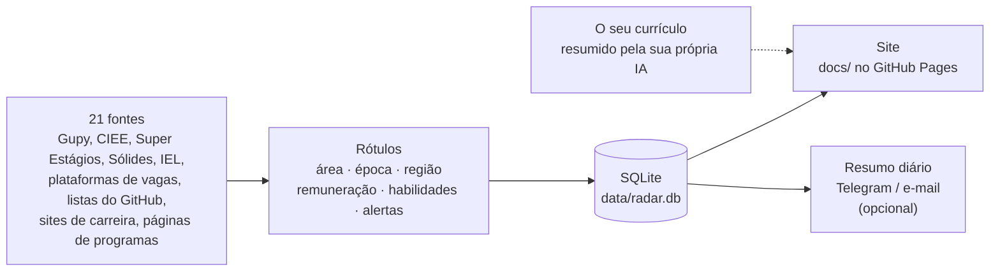

<p align="center">
  <a href="https://pedrocamargolince.github.io/vagaLume/">
    
  </a>
</p>

<p align="center"><a href="README.en.md"></a></p>

<p align="center">
  <a href="https://pedrocamargolince.github.io/vagaLume/"></a>
  <a href="https://github.com/PedroCamargoLINCE/vagaLume"></a>
  <a href="GUIDE.md"></a>
  <a href="https://github.com/PedroCamargoLINCE/vagaLume/fork"></a>
</p>

<p align="center">
  
  
  
  
  
  <a href="https://github.com/PedroCamargoLINCE/vagaLume/actions/workflows/radar.yml"></a>
</p>

<p align="center">
  <b>Todo estágio, programa de pesquisa, fellowship e escola de verão para estudantes,<br>
  coletados toda manhã e ordenados pelo quanto combinam com <i>você</i>.</b>
</p>

<p align="center">
  
</p>

---

## Por que vagaLume?

Procurar estágio significa abrir dezenas de páginas de carreira, algumas listas
no GitHub, a Gupy e o site de cada escola de verão, toda semana. Um *vagalume*
é uma luzinha no escuro: o vagaLume ilumina as vagas para você.

| | |
|---|---|
| 🇧🇷 **O Brasil inteiro** | Todos os estágios da Gupy, do CIEE, da Super Estágios, da Sólides e do IEL, os programas da Cia de Talentos, bolsas da FAPESP e as vagas de estágio de multinacionais (Santander, P&G, Citi, Bosch, Syngenta…). **Mais de 11.000 vagas no Brasil**, com o valor da bolsa em 2 de cada 3. |
| 🔭 **21 fontes, uma lista** | Também páginas Greenhouse, Lever e Ashby de mais de 160 empresas, as listas da SimplifyJobs, Google, Amazon, Microsoft, NVIDIA, Meta, D. E. Shaw, DRW e 42 páginas de programas de pesquisa e verão. Cerca de **17.000 vagas abertas** num dia normal. |
| 🎯 **Ordenado por compatibilidade, nunca filtrado por você** | Diga se você está na graduação, no mestrado ou no doutorado e onde estuda. Cada vaga ganha um ponto (boa, verificar algo, improvável) e o motivo, como *"exige autorização de trabalho nos EUA"* ou *"voltada a doutorandos"*. Nada some, a menos que você esconda. |
| 📄 **Compare com o seu currículo** | Cole um prompt pronto e o seu currículo na IA que você já usa (ChatGPT, Gemini, Claude…), traga a resposta de volta, e cada vaga mostra o quanto combina: *"você tem 6 das 10 habilidades que ela cita"*. Nenhuma IA roda dentro do vagaLume e o seu currículo não sai das suas mãos. |
| 💸 **Remuneração, quando informada** | `$54–60/hr`, `R$1,357/mo`, `€1,800/mo`: lida das plataformas de vagas e das descrições, em inglês e em português. |
| 📅 **Cabe no seu calendário?** | Uma tirinha de janeiro a dezembro em cada vaga mostra se ela cai nas suas férias ou bate com o semestre. |
| ⏰ **Prazos em destaque** | Vagas que fecham logo e vagas novas têm abas próprias. |
| ☆ **A sua lista** | Salve, marque como candidatado ou esconda. Os filtros ficam no link, então dá para guardar *"vagas de ML na Europa"* ou mandar para um amigo. |

> 🇧🇷 **O site também está em português**: ele abre em português se o seu
> navegador estiver em português, e o botão **EN | PT** no topo troca a língua
> a qualquer momento. O prompt do currículo também vem em português.

<details>
<summary><b>Algumas das empresas e programas acompanhados</b></summary>
<br>

**Laboratórios de IA:** Anthropic, OpenAI, xAI, Cohere, Thinking Machines, Perplexity, Cursor, ElevenLabs, Physical Intelligence, Isomorphic Labs<br>
**Big techs:** Google, Microsoft, Meta, Amazon, NVIDIA, Stripe, Databricks, SpaceX, Cloudflare, Figma<br>
**Trading:** Jane Street, Hudson River Trading, Jump, Optiver, IMC, Two Sigma, D. E. Shaw, DRW, SIG, Five Rings<br>
**Brasil:** todos os estágios da Gupy, CIEE, Super Estágios, Sólides e IEL; Nubank, Stone, QuintoAndar, BTG Pactual, XP, Banco Inter, C6, EBANX, VTEX, CI&T, Santander, Itaú, Embraer, Bosch, Syngenta, Ambev (AB InBev)<br>
**Pesquisa no Brasil:** FAPESP Oportunidades, CNPEM Bolsas de Verão, programas de verão do ICMC, IME-USP e LNCC, ICTP-SAIFR<br>
**Programas de pesquisa e escolas:** ISTA ISTernship, ETH SSRF, Summer@EPFL, OIST, KAUST VSRP, Mitacs Globalink, Google Student Researcher, Anthropic Fellows, MATS, EEML, OxML, MLSS, Khipu, LatinX in AI, Programa de Verão do IMPA

</details>

## Veja



Funciona no celular também, no modo claro e no escuro. **[Abrir →](https://pedrocamargolince.github.io/vagaLume/)**

## Comparar com o seu currículo

1. No site, clique em **Comparar currículo** e copie o prompt.
2. Cole o prompt na IA que você usa (ChatGPT, Gemini, Claude…) e anexe o seu
   currículo. O prompt pede um resumo curto em JSON, **sem nome nem contatos**.
3. Cole a resposta de volta no site.

Pronto: cada vaga ganha um nível de match (*forte*, *bom*…),
dá para ordenar por "melhor match" e, ao abrir uma vaga, você vê quais
habilidades você tem (✓) e quais faltam. O resumo também deixa a análise mais
precisa: países onde você já pode trabalhar deixam de gerar alerta de visto,
vagas de recém-formado passam a valer se você se forma em até um ano, e os
meses livres do seu calendário substituem o calendário da UNESP.



Tudo fica salvo só no seu navegador. O vagaLume não tem servidor e nunca vê o
seu currículo.

## Como funciona



Toda manhã, às 09:00 (Brasília), uma GitHub Action roda o bot em Python, lê
cada fonte com educação (ele se identifica e espera entre os pedidos), rotula
cada vaga com regras de palavras-chave, opcionalmente pede ao Claude rótulos
mais precisos, e publica o resultado. Uma fonte com problema nunca derruba a
execução, e a tabela de fontes no site mostra quais funcionaram.

## Rode o seu em 5 minutos

1. **[Faça um fork deste repositório](https://github.com/PedroCamargoLINCE/vagaLume/fork).**
2. No seu fork, vá em **Settings → Actions → General** e escolha **Read and write permissions**.
3. Vá em **Settings → Pages → Deploy from a branch → `main` / `/docs`**.
4. Abra **Actions → vagaLume → Run workflow**. Alguns minutos depois o seu site estará em `https://<seu-usuario>.github.io/vagaLume/`.
5. Deixe do seu jeito: adicione empresas em [`config/companies.yaml`](config/companies.yaml), programas em [`config/programs.yaml`](config/programs.yaml) e buscas em [`config/search.yaml`](config/search.yaml).

Opcional: resumos por Telegram ou e-mail e rótulos feitos pelo Claude. Como
configurar os segredos está no [guia](GUIDE.md#secrets-all-optional) (em inglês).

```bash
# ou rode no seu computador
pip install -r requirements.txt
python -m playwright install chromium
python -m radar          # coleta tudo (uns 8 minutos)
python -m http.server -d docs   # depois abra http://localhost:8000
```

## Saiba mais

O **[guia completo](GUIDE.md)** (em inglês) explica cada fonte e os seus
limites, o que significa cada rótulo e alerta, como a remuneração e as
habilidades são detectadas, como adicionar uma empresa ou um programa, a
organização do código (escrito para iniciantes conseguirem ler) e os testes.

## Gostou? ⭐

Se o vagaLume te ajudar a encontrar algo, **dê uma estrela no repositório**.
É o jeito mais fácil de ajudar outros estudantes a encontrá-lo também.

<p align="center">
  <a href="https://github.com/PedroCamargoLINCE/vagaLume"></a>
</p>

<p align="center">
  <a href="https://star-history.com/#PedroCamargoLINCE/vagaLume&Date">
    <picture>
      <source media="(prefers-color-scheme: dark)" srcset="https://api.star-history.com/svg?repos=PedroCamargoLINCE/vagaLume&type=Date&theme=dark">
      
    </picture>
  </a>
</p>

<p align="center"><sub>Feito no Brasil por um estudante de engenharia da UNESP · licença MIT · sem raspagem do LinkedIn, sem sites que bloqueiam bots</sub></p>
